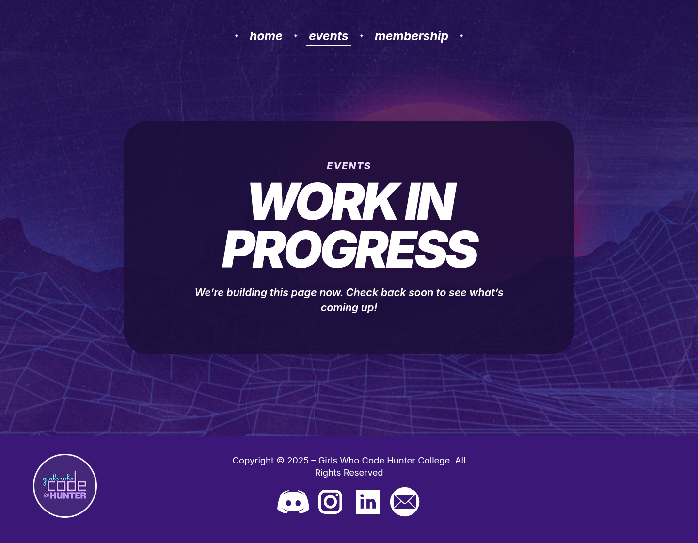
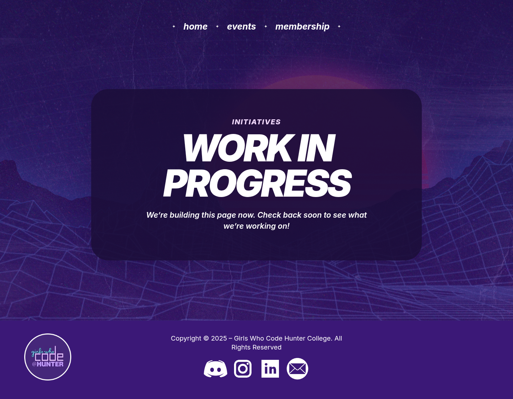

# Page gallery

These reference images were captured locally with a 1440 × 900 desktop viewport on August 31, 2026. Reduced motion was enabled so animated elements appear in a deterministic final state. The images document the current frontend presentation rather than a production data state.

Home is the completed landing experience. Events, Membership, and Initiatives currently show Work in Progress placeholders; their previous implementations remain preserved in source comments for future development.

## Home

Route: `/`

The redesigned Home page combines a full-viewport hero with the fixed retro sky, glowing CRT sun, refined Girls Who Code @ Hunter presentation, Join Us action, and Scroll to Learn More cue. The page continues through the Who Are We introduction, a viewport- and hover-triggered Polaroid gallery with full-size photo dialogs, an interactive team directory, and an FAQ accordion.

## Membership

Route: `/membership`

The active Membership route currently displays a Work in Progress page. Its previous frontend-only form remains preserved in source comments but is not rendered or connected to submissions.

## Events

Route: `/events`

The active Events route displays a Work in Progress page until current event data and RSVP behavior are ready.

## Initiatives

Route: `/initiatives`

The active Initiatives route displays a Work in Progress page. It remains directly accessible for development and future use but is currently omitted from primary navigation.

## Not Found

Route: any unmatched URL

The fallback page keeps the shared centered navigation and footer and provides a clear return path to Home.

## Preserved design references

The following historical screenshots show the complete Events and Initiatives implementations retained in source comments. They were captured on August 28, 2026 and include the older shared navigation, so they are references rather than current route previews.

### Events — preserved full design

The preserved Events design presents a configurable featured-event title, schedule, and RSVP action.

### Initiatives — preserved full design

The preserved Initiatives design contains a hero, category chips, and a typed card grid for four student programs.

