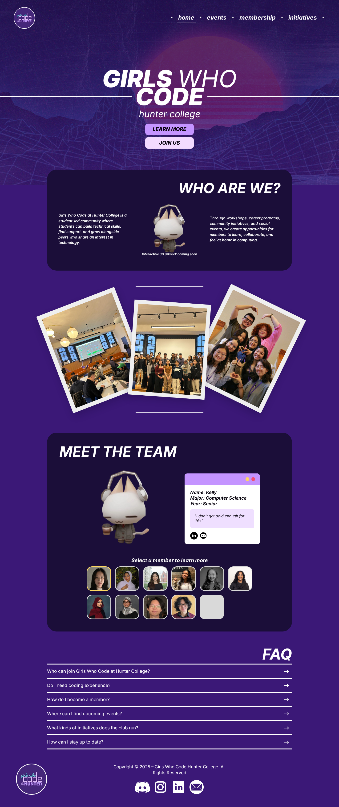
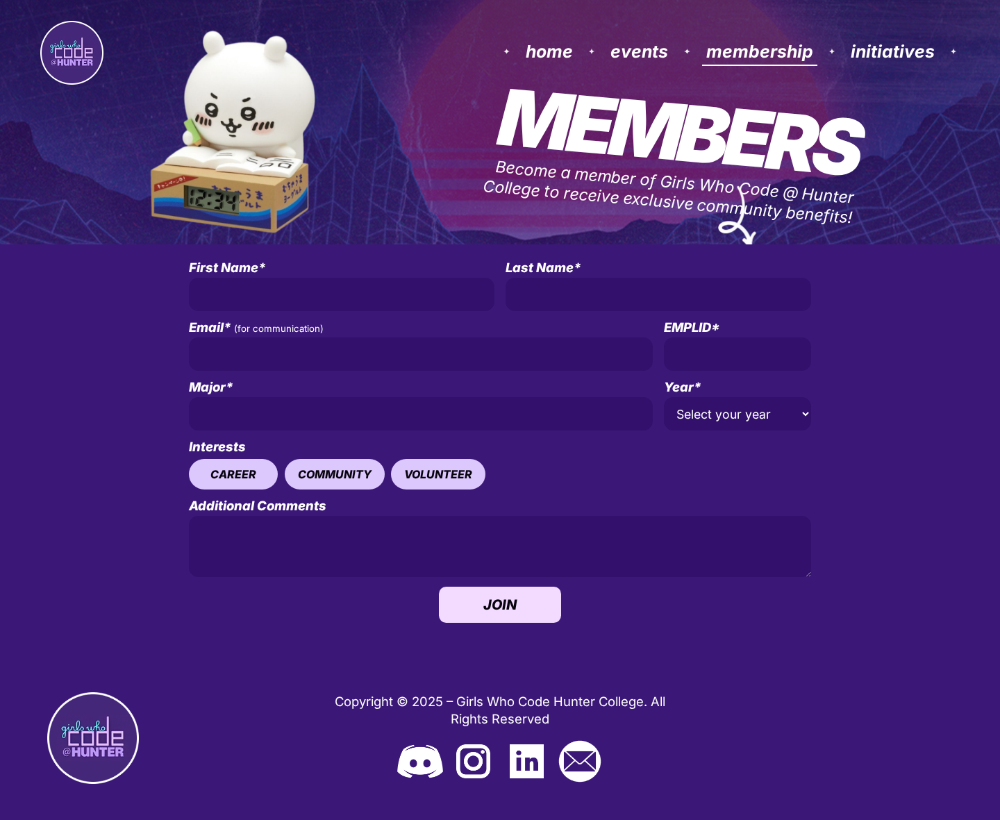
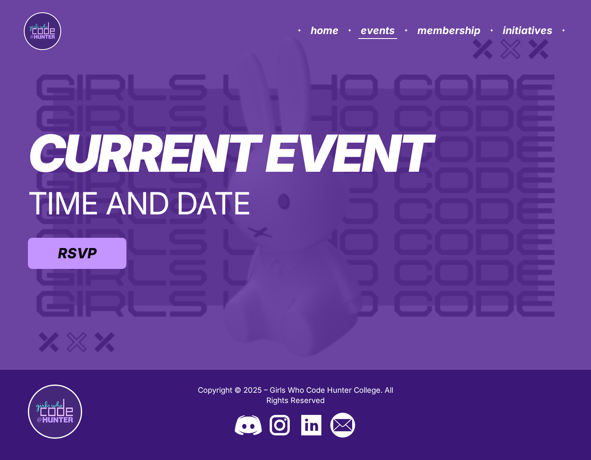
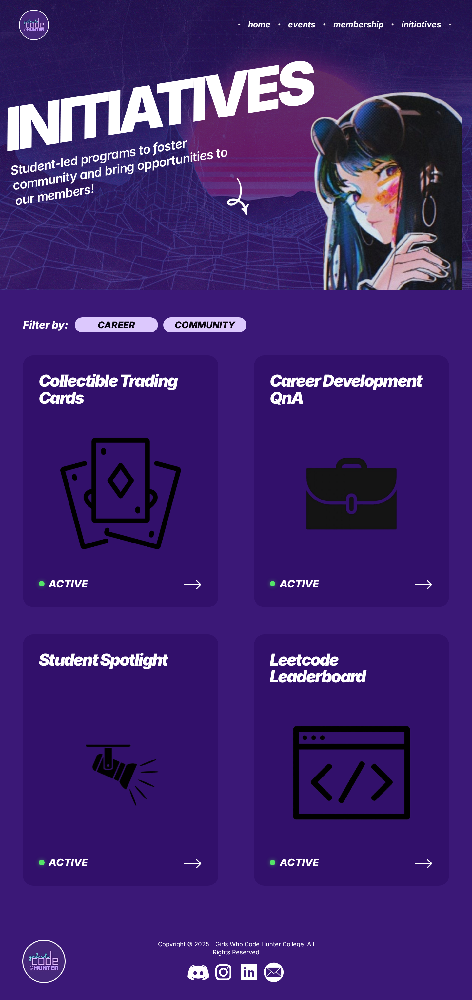
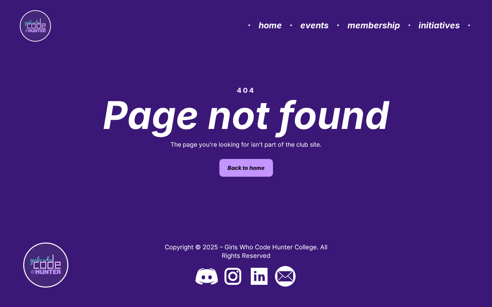

# MVP page gallery

These reference images were captured locally at a 1440px desktop width on August 28, 2026. They document the complete frontend presentation rather than a production data state.

Events and Initiatives currently show Work in Progress placeholders in the MVP. Their images below were captured from the complete implementations preserved in their source files, as requested, so future contributors can see the intended designs.

## Home

Route: `/`

The Home page introduces the club, provides direct Learn More and Join Us actions, explains the community, shows event photography, presents an interactive member directory, and ends with frequently asked questions.

## Membership

Route: `/membership`

The Membership page combines the member hero and the entire responsive form. The MVP handles validation in the browser and shows a confirmation message, but it does not persist or transmit submissions.

## Events — preserved full design

Route: `/events`

The preserved Events design presents a configurable featured-event title, schedule, and RSVP action. The active MVP route currently replaces this view with a Work in Progress page until real event content and an RSVP destination are ready.

## Initiatives — preserved full design

Route: `/initiatives`

The preserved Initiatives design contains a hero, category chips, and a typed card grid for four student programs. The active MVP route currently replaces this directory with a Work in Progress page.

## Not Found

Route: any unmatched URL

The fallback page keeps the shared navigation and footer and provides a clear return path to Home.

